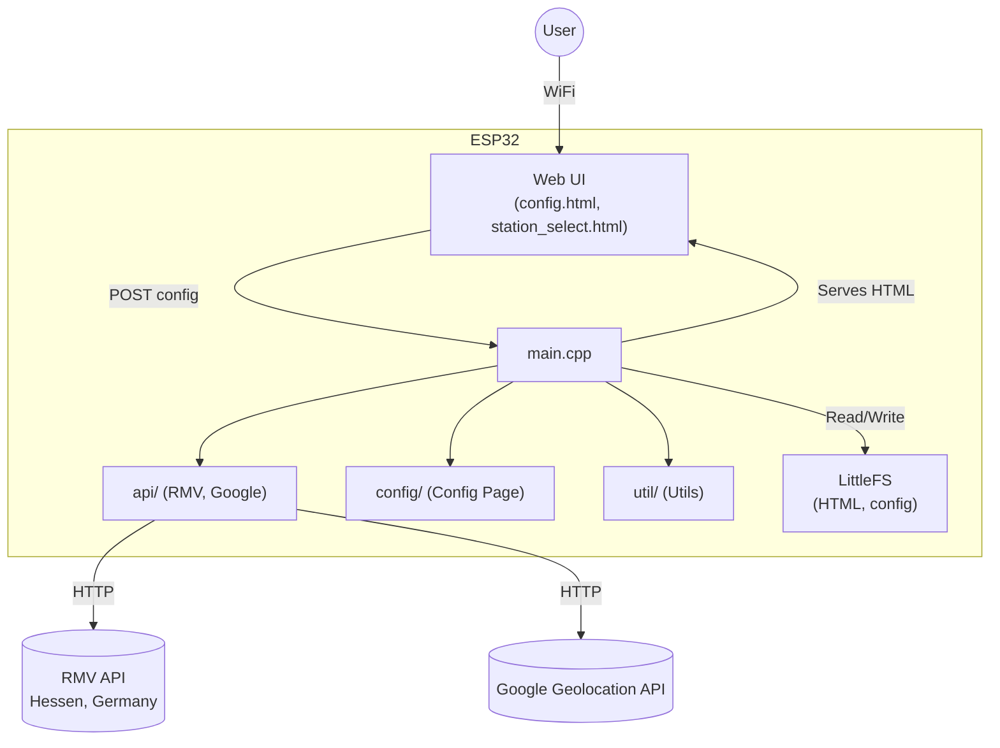
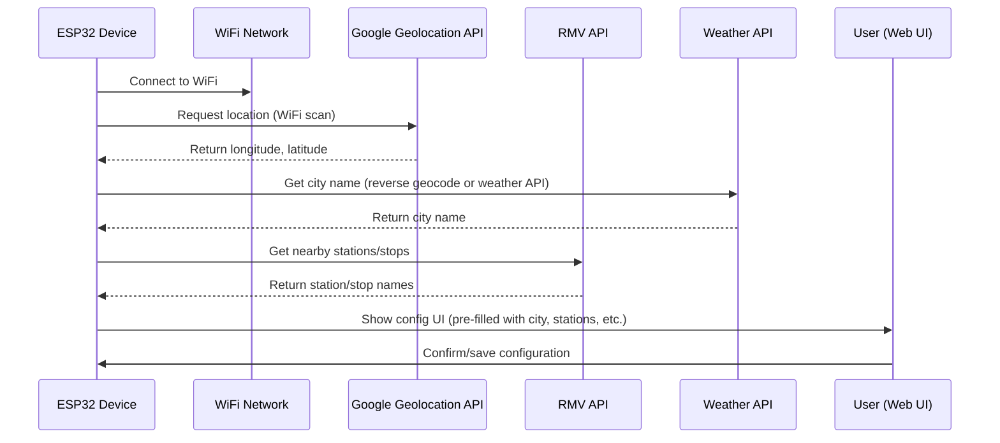
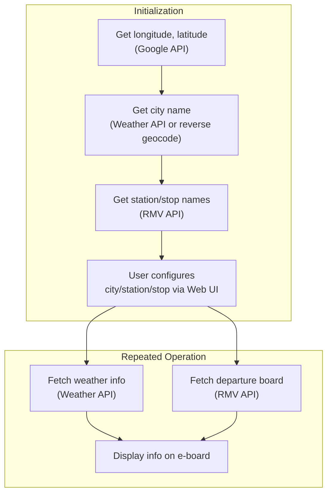

# e-board: ESP32-based Station Information Board

## Overview
This project is an ESP32-powered electronic board that displays station information, retrieves real-time data from the RMV API, and provides a web-based configuration interface. It is designed for easy deployment and configuration via WiFi and a modern web UI.

> **Note:** The Deutsche Bahn (DB) API is not supported in this project because its commercial terms and pricing are too expensive for hobby and open-source use. Only the RMV API (Hessen, Germany) is implemented for public transport data.
>
> **Planned/Implemented:** Support for public transport APIs of Germany's top 5 cities (e.g., Berlin, Hamburg, Munich, Cologne, Frankfurt) will be implemented or is already implemented, as long as their API call prices are reasonable for hobby and open-source projects.

## Features
- ESP32-C3 support (tested on simple mini dev boards)
- WiFi configuration via captive portal (WiFiManager)
- **Automatic location detection:** The device uses WiFi scanning and the Google Geolocation API to determine its current latitude and longitude, which are then used to find nearby stations.
- RMV API integration for real-time station and departure info
- Web server with:
  - Dynamic station selection page
  - Configuration page (UTF-8, mobile-friendly)
- Filesystem (LittleFS) for serving HTML templates and storing config
- Modular C++ code structure (API, config, util)

## About the RMV API
The RMV (Rhein-Main-Verkehrsverbund) API provides access to public transportation data for the Hessen region in Germany. It allows you to:
- Find nearby stations based on geographic coordinates (latitude/longitude)
- Retrieve real-time departure and arrival information for buses, trains, and other public transport
- Integrate with other RMV services for comprehensive travel information

For more details, see the [RMV API documentation](https://www.rmv.de/c/de/hapi/overview).

---

## System Architecture (Mermaid Diagram)


---

## Device Initialization & Configuration Flow


---

## Runtime Data Flow


---

## Directory Structure
```
├── data/
│   ├── config.html           # Web UI template for configuration
│   └── station_select.html   # Web UI for station selection
├── src/
│   ├── api/                  # API logic (RMV, Google)
│   ├── config/               # Web config page logic
│   ├── util/                 # Utility functions
│   ├── secrets/              # API keys (not committed)
│   └── main.cpp              # Main application
├── platformio.ini            # PlatformIO project config
```

## Getting Started
1. **Clone the repository**
2. **Install PlatformIO** (VSCode recommended)
3. **Configure your secrets**
   - Copy `src/secrets/secrets.h.example` and `src/secrets/rmv_secrets.h.example` to `src/secrets/secrets.h` and `src/secrets/rmv_secrets.h`, then fill in your API keys.
4. **Upload the filesystem image**
   - Place your HTML files in `data/` and run `PlatformIO: Upload File System image`.
5. **Build and upload the firmware**
6. **Connect to the ESP32 AP and configure via the web UI**

## Configuration Web UI
- Access the ESP32's IP in your browser after connecting to its WiFi.
- The configuration page is served from `config.html` and supports UTF-8.
- All settings are saved and applied on the device.

## Dependencies
- [WiFiManager](https://github.com/tzapu/WiFiManager)
- [ArduinoJson](https://github.com/bblanchon/ArduinoJson)
- [LittleFS](https://github.com/lorol/LITTLEFS)

## License
MIT
