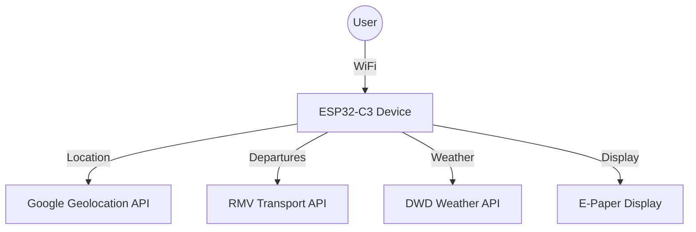
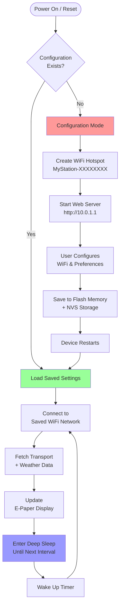

# MyStation E-Board

> ESP32-C3 powered public transport departure board with e-paper display

[](https://opensource.org/licenses/MIT)
[](https://platformio.org/)
[](https://www.espressif.com/en/products/socs/esp32-c3)

## ✨ Features

- 🚌 **Real-time departures** from German public transport (RMV API)
- 🌤️ **Weather information** from German Weather Service (DWD)
- 📱 **Mobile-friendly web configuration** with privacy focus
- 🔋 **Ultra-low power** with intelligent deep sleep scheduling
- 📡 **WiFi auto-discovery** and mDNS support
- 🔒 **Privacy-conscious** - all processing happens locally
- 🎨 **E-paper display** optimized for outdoor visibility

## 🚀 Quick Start

### 1. Hardware Setup
Connect ESP32-C3 Super Mini to e-paper display:
```
ESP32-C3    →    E-Paper Display
GPIO 2      →    BUSY
GPIO 3      →    CS
GPIO 4      →    SCK
GPIO 6      →    SDI (MOSI)
GPIO 8      →    RES
GPIO 9      →    DC
3.3V        →    VCC
GND         →    GND
```

### 2. Software Setup
```bash
# Clone repository
git clone <repository-url>
cd e-board

# Install PlatformIO and build
pio run --target upload
pio run --target uploadfs
```

### 3. Configuration
1. Connect to `MyStation-XXXXXXXX` WiFi network
2. Open browser to configure your location and transport stops
3. Device automatically switches to operational mode

**📖 [Complete Setup Guide](./docs/quick-start.md)**

## 📚 Documentation

| Topic | Description |
|-------|-------------|
| **[📖 Quick Start](./docs/quick-start.md)** | Get running in 5 minutes |
| **[🔧 Hardware Setup](./docs/hardware-setup.md)** | Wiring and pin definitions |
| **[💻 Software Setup](./docs/software-setup.md)** | Development environment |
| **[🔑 API Keys](./docs/api-keys.md)** | Required API configuration |
| **[📱 Display Modes](./docs/display-modes.md)** | Screen layouts and orientations |
| **[⚙️ Configuration](./docs/configuration.md)** | Detailed options |
| **[🛠️ Troubleshooting](./docs/troubleshooting.md)** | Common issues |

**[📚 Complete Documentation](./docs/)**

## 🏗️ Architecture



### Key Components
- **ESP32-C3 Super Mini**: Main controller with WiFi
- **E-Paper Display**: Low-power outdoor-readable screen  
- **APIs**: Google (location), RMV (transport), DWD (weather)
- **Deep Sleep**: Battery-optimized operation
- **Web Interface**: Configuration and status

## 📱 Display Modes & Orientations

The e-board features a flexible display manager that supports multiple viewing modes and orientations optimized for different use cases.

### 🔄 Display Orientations

#### Portrait Mode (Default)
- **Resolution**: 800×480 pixels
- **Layout**: Side-by-side split
- **Weather**: Left half (400×480px)
- **Departures**: Right half (400×480px)
- **Best for**: Wall mounting, narrow spaces

#### Landscape Mode
- **Resolution**: 480×800 pixels (rotated)
- **Layout**: Top-bottom split
- **Weather**: Top half (480×400px)
- **Departures**: Bottom half (480×400px)
- **Best for**: Desk placement, wide viewing

### 🎛️ Display Modes

#### 1. Half-and-Half Mode (Default)
Split screen showing both weather and transport information:

**Portrait Layout:**
```
┌─────────────┬─────────────┐
│   Weather   │ Departures  │
│             │             │
│ 🌤️ 22°C     │ 🚌 S1 → FFM │
│ Frankfurt   │ Bus 61 5min │
│ Sunny       │ RE 14:25    │
│ H:25° L:15° │ S8 delayed  │
│             │             │
└─────────────┴─────────────┘
```

**Landscape Layout:**
```
┌─────────────────────────────┐
│        Weather Info         │
│ 🌤️ 22°C Frankfurt Sunny    │
└─────────────────────────────┘
┌─────────────────────────────┐
│      Departure Board        │
│ 🚌 Line  Destination  Time  │
│   S1    Frankfurt    14:23  │
└─────────────────────────────┘
```

#### 2. Weather-Only Mode
Full screen weather with detailed forecast:
```
┌─────────────────────────────┐
│  🌤️ Weather Information     │
│                            │
│  22°C  Frankfurt           │
│  Partly Cloudy             │
│  High: 25°C  Low: 15°C     │
│                            │
│  Next Hours:               │
│  14:00  23°C  10% rain     │
│  15:00  24°C  5% rain      │
│  16:00  25°C  0% rain      │
│                            │
│  ☀️↑ 06:30  ☀️↓ 20:45      │
└─────────────────────────────┘
```

#### 3. Departures-Only Mode
Full screen departure board with more details:
```
┌─────────────────────────────┐
│    🚌 Departure Board       │
│                            │
│  Frankfurt Hauptbahnhof    │
│                            │
│  Line  Destination    Time │
│  ────────────────────────── │
│  S1    Wiesbaden     14:23 │
│  RE1   Fulda         14:25 │
│  Bus61 Sachsenhausen 14:27 │
│  S8    Hanau         14:30 │
│  U4    Bockenheim    14:32 │
│                            │
│  Updated: 23s ago          │
└─────────────────────────────┘
```

### ⚡ Partial Updates

The display manager supports efficient partial updates:

- **Weather Half Only**: Updates weather without clearing departures
- **Departure Half Only**: Updates departures without clearing weather  
- **Smart Scheduling**: Weather updates every 10 minutes, departures every 2 minutes
- **Power Efficient**: Partial updates are faster and use less power

### 🎨 Adaptive Content

Content automatically adapts based on available space:

#### Half-Screen Mode
- **Condensed layout** for essential information
- **Shortened text** for station names and directions
- **Prioritized data** (current temp, next departures)
- **Compact fonts** for maximum readability

#### Full-Screen Mode
- **Detailed information** with full descriptions
- **Extended forecast** (6-hour weather preview)
- **More departures** (up to 15 entries)
- **Larger fonts** for better visibility

### 🔧 Technical Features

- **Automatic Mode Selection**: Chooses best mode based on available data
- **Graceful Degradation**: Shows single mode if only one data source available
- **Error Handling**: Clear error messages for connection issues
- **Memory Efficient**: Optimized for ESP32-C3's limited resources

### 📐 Font Scaling

The display uses three font sizes that scale based on mode:

- **Large (18pt)**: Titles, current temperature
- **Medium (12pt)**: Important data, station names
- **Small (9pt)**: Details, timestamps, secondary info

### 🎯 Usage Examples

```cpp
// Initialize display manager
DisplayManager::init(DisplayOrientation::PORTRAIT);

// Half-and-half mode (default)
DisplayManager::displayHalfAndHalf(&weather, &departures);

// Update only weather (partial update)
DisplayManager::updateWeatherHalf(weather);

// Full screen modes
DisplayManager::displayWeatherOnly(weather);
DisplayManager::displayDeparturesOnly(departures);

// Change orientation
DisplayManager::setMode(DisplayMode::HALF_AND_HALF, 
                       DisplayOrientation::LANDSCAPE);
```

**[📖 Display Manager Documentation](./docs/display-modes.md)**

## � Boot Process & Device States

### First Boot (Initial Setup)
When the device is powered on for the first time:

1. **Enters Configuration Mode** automatically
2. **Creates WiFi Access Point** (`MyStation-XXXXXXXX`)
3. **Waits for user setup** via web interface at `http://10.0.1.1`
4. **User configures**:
   - WiFi SSID and password
   - Preferred transport stations and filters
   - Update intervals and display preferences
5. **Saves configuration permanently** to flash memory (NVS)
6. **Switches to operational mode** and begins normal operation

### After Configuration (Normal Operation)
Once configured, the device operates autonomously:

1. **Connects to saved WiFi network** automatically
2. **Fetches real-time data** (departures, weather)
3. **Updates e-paper display** with current information
4. **Enters deep sleep** until next scheduled update
5. **Repeats cycle** based on configured intervals

### Power Loss and Restart
When power is restored after battery change or power interruption:

1. **Loads configuration from flash memory** (NVS - Non-Volatile Storage)
2. **Resumes normal operation** with saved preferences
3. **No reconfiguration needed** - all settings persist
4. **Continues with scheduled updates** as configured

### Reboot/Reset
After manual reset or firmware update:

1. **Detects previous configuration** in flash memory
2. **Automatically resumes operational mode** if configured
3. **Preserves all user settings** including:
   - WiFi credentials
   - Station preferences and filters
   - Update intervals
   - Location data
4. **Skips configuration mode** and starts normal operation immediately

> **💡 Configuration Persistence**: All settings are permanently stored in flash memory and survive power loss, reboots, and firmware updates. The device only enters configuration mode on first boot or when explicitly requested.

### Boot Process Flow


## �🔋 Power Management

- **Active Mode**: ~100mA (during data fetch)
- **Deep Sleep**: <50μA (between updates)  
- **Battery Life**: 2-4 weeks on 2000mAh (5-min intervals)
- **Smart Scheduling**: Reduced updates during night hours

## 🌍 Coverage

- **Transport**: Hesse, Germany (RMV network)
  - Frankfurt, Wiesbaden, Kassel, Darmstadt, etc.
  - Trains, buses, trams, S-Bahn
- **Weather**: Germany and surrounding areas (DWD)
- **Extensible**: Adapt for other regions/APIs

## 🛠️ Development

### Prerequisites
- PlatformIO IDE (VS Code recommended)
- ESP32-C3 development board
- API keys (Google, RMV)

### Project Structure
```
├── docs/                    # Documentation
├── include/                 # Header files (best practice)
│   ├── api/                # API interface definitions
│   ├── config/             # Configuration structures
│   ├── util/               # Utility class definitions
│   └── secrets/            # API keys (gitignored)
├── src/                    # Source code implementation
│   ├── api/               # External API integrations
│   │   ├── dwd_weather_api.cpp
│   │   ├── google_api.cpp
│   │   └── rmv_api.cpp
│   ├── config/            # Configuration management
│   │   ├── config_manager.cpp
│   │   └── config_page.cpp
│   ├── util/              # Utilities and helpers
│   │   ├── display_manager.cpp    # 📱 New display system
│   │   ├── device_mode_manager.cpp
│   │   ├── weather_print.cpp
│   │   ├── departure_print.cpp
│   │   └── wifi_manager.cpp
│   └── main.cpp           # Main application
├── data/                  # Web interface files
└── platformio.ini    # Build configuration
```

### Contributing
1. Fork the repository
2. Create feature branch
3. Test thoroughly
4. Submit pull request

**[🔧 Development Guide](./docs/development.md)**

## 📄 License

MIT License - see [LICENSE](LICENSE) file for details.

---

**🚀 Ready to build your own departure board?**  
**[Start with the Quick Start Guide →](./docs/quick-start.md)**
