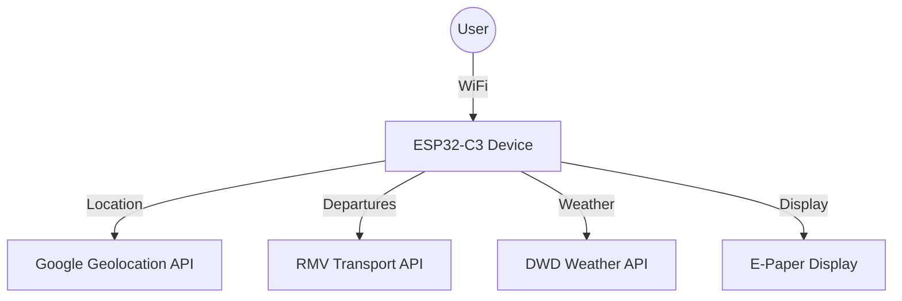

# MyStation E-Board

> ESP32-C3 powered public transport departure board with e-paper display

[](https://opensource.org/licenses/MIT)
[](https://platformio.org/)
[](https://www.espressif.com/en/products/socs/esp32-c3)

## ✨ Features

- 🚌 **Real-time departures** from German public transport (RMV API)
- 🌤️ **Weather information** from German Weather Service (DWD)
- 📱 **Mobile-friendly web configuration** with privacy focus
- 🔋 **Ultra-low power** with intelligent deep sleep scheduling
- 📡 **WiFi auto-discovery** and mDNS support
- 🔒 **Privacy-conscious** - all processing happens locally
- 🎨 **E-paper display** optimized for outdoor visibility

## 🚀 Quick Start

### 1. Hardware Setup
Connect ESP32-C3 Super Mini to e-paper display:
```
ESP32-C3    →    E-Paper Display
GPIO 2      →    BUSY
GPIO 3      →    CS
GPIO 4      →    SCK
GPIO 6      →    SDI (MOSI)
GPIO 8      →    RES
GPIO 9      →    DC
3.3V        →    VCC
GND         →    GND
```

### 2. Software Setup
```bash
# Clone repository
git clone <repository-url>
cd e-board

# Install PlatformIO and build
pio run --target upload
pio run --target uploadfs
```

### 3. Configuration
1. Connect to `MyStation-XXXXXXXX` WiFi network
2. Open browser to configure your location and transport stops
3. Device automatically switches to operational mode

**📖 [Complete Setup Guide](./docs/quick-start.md)**

## 📚 Documentation

| Topic | Description |
|-------|-------------|
| **[📖 Quick Start](./docs/quick-start.md)** | Get running in 5 minutes |
| **[🔧 Hardware Setup](./docs/hardware-setup.md)** | Wiring and pin definitions |
| **[💻 Software Setup](./docs/software-setup.md)** | Development environment |
| **[🔑 API Keys](./docs/api-keys.md)** | Required API configuration |
| **[⚙️ Configuration](./docs/configuration.md)** | Detailed options |
| **[🛠️ Troubleshooting](./docs/troubleshooting.md)** | Common issues |

**[📚 Complete Documentation](./docs/)**

## 🏗️ Architecture



### Key Components
- **ESP32-C3 Super Mini**: Main controller with WiFi
- **E-Paper Display**: Low-power outdoor-readable screen  
- **APIs**: Google (location), RMV (transport), DWD (weather)
- **Deep Sleep**: Battery-optimized operation
- **Web Interface**: Configuration and status

## � Boot Process & Device States

### First Boot (Initial Setup)
When the device is powered on for the first time:

1. **Enters Configuration Mode** automatically
2. **Creates WiFi Access Point** (`MyStation-XXXXXXXX`)
3. **Waits for user setup** via web interface at `http://10.0.1.1`
4. **User configures**:
   - WiFi SSID and password
   - Preferred transport stations and filters
   - Update intervals and display preferences
5. **Saves configuration permanently** to flash memory (NVS)
6. **Switches to operational mode** and begins normal operation

### After Configuration (Normal Operation)
Once configured, the device operates autonomously:

1. **Connects to saved WiFi network** automatically
2. **Fetches real-time data** (departures, weather)
3. **Updates e-paper display** with current information
4. **Enters deep sleep** until next scheduled update
5. **Repeats cycle** based on configured intervals

### Power Loss and Restart
When power is restored after battery change or power interruption:

1. **Loads configuration from flash memory** (NVS - Non-Volatile Storage)
2. **Resumes normal operation** with saved preferences
3. **No reconfiguration needed** - all settings persist
4. **Continues with scheduled updates** as configured

### Reboot/Reset
After manual reset or firmware update:

1. **Detects previous configuration** in flash memory
2. **Automatically resumes operational mode** if configured
3. **Preserves all user settings** including:
   - WiFi credentials
   - Station preferences and filters
   - Update intervals
   - Location data
4. **Skips configuration mode** and starts normal operation immediately

> **💡 Configuration Persistence**: All settings are permanently stored in flash memory and survive power loss, reboots, and firmware updates. The device only enters configuration mode on first boot or when explicitly requested.

### Boot Process Flow


## �🔋 Power Management

- **Active Mode**: ~100mA (during data fetch)
- **Deep Sleep**: <50μA (between updates)  
- **Battery Life**: 2-4 weeks on 2000mAh (5-min intervals)
- **Smart Scheduling**: Reduced updates during night hours

## 🌍 Coverage

- **Transport**: Hesse, Germany (RMV network)
  - Frankfurt, Wiesbaden, Kassel, Darmstadt, etc.
  - Trains, buses, trams, S-Bahn
- **Weather**: Germany and surrounding areas (DWD)
- **Extensible**: Adapt for other regions/APIs

## 🛠️ Development

### Prerequisites
- PlatformIO IDE (VS Code recommended)
- ESP32-C3 development board
- API keys (Google, RMV)

### Project Structure
```
├── docs/              # Documentation
├── src/               # Source code
│   ├── api/          # External API integrations
│   ├── config/       # Configuration management  
│   ├── util/         # Utilities and helpers
│   └── main.cpp      # Main application
├── data/             # Web interface files
└── platformio.ini    # Build configuration
```

### Contributing
1. Fork the repository
2. Create feature branch
3. Test thoroughly
4. Submit pull request

**[🔧 Development Guide](./docs/development.md)**

## 📄 License

MIT License - see [LICENSE](LICENSE) file for details.

---

**🚀 Ready to build your own departure board?**  
**[Start with the Quick Start Guide →](./docs/quick-start.md)**
