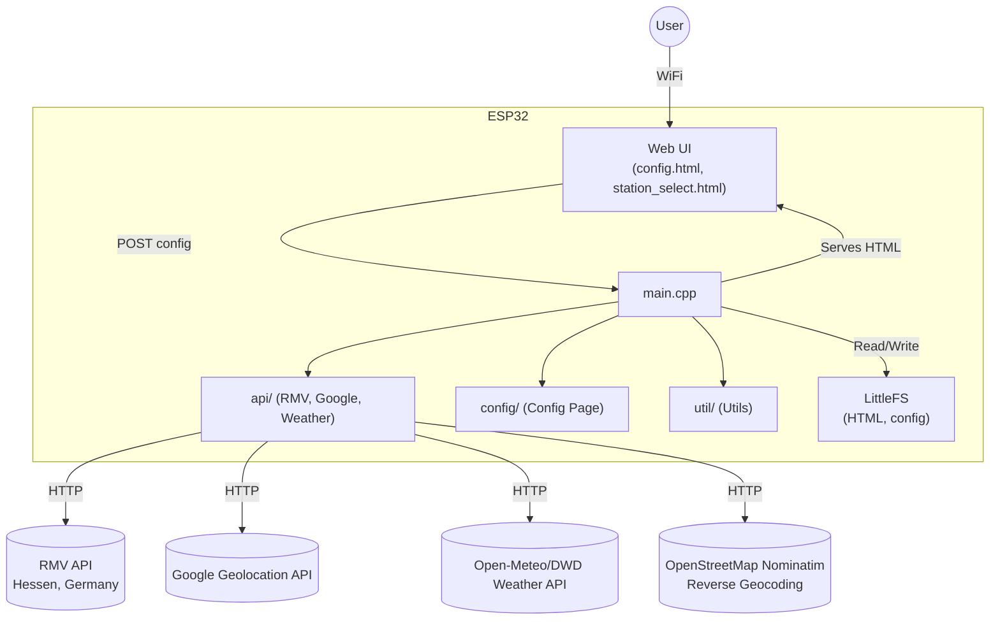
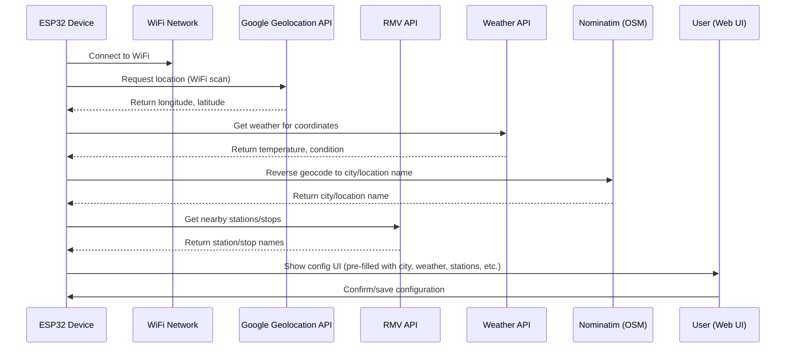
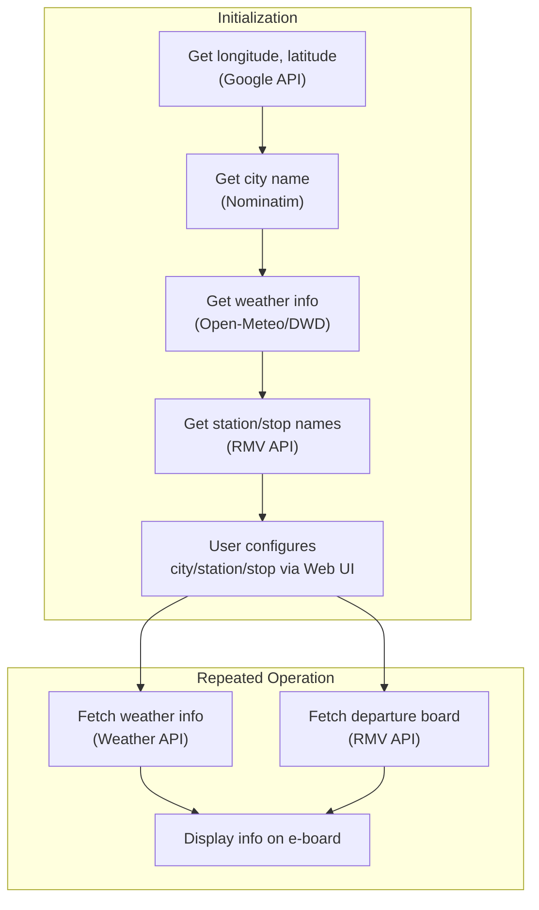

# e-board: ESP32-based Station Information Board

## Overview
This project is an ESP32-powered electronic board that displays station information, retrieves real-time data from the RMV API, fetches current weather information, and provides a web-based configuration interface. It is designed for easy deployment and configuration via WiFi and a modern web UI.

  
## Weather API Integration
- The board fetches current weather data using the Open-Meteo API, which provides free access to Deutscher Wetterdienst (DWD) weather data for Germany and Europe.
- Weather is retrieved based on the device's latitude and longitude (from Google Geolocation API).
- The city or nearest location name is determined using OpenStreetMap Nominatim reverse geocoding.
- Weather information (temperature, condition, location) is available for display or further use in the application.

## Features
- ESP32-C3 support (tested on simple mini dev boards)
- WiFi configuration via captive portal (WiFiManager)
- **Automatic location detection:** The device uses WiFi scanning and the Google Geolocation API to determine its current latitude and longitude, which are then used to find nearby stations and fetch weather data.
- **Weather API integration:** Fetches current weather (temperature, condition) for the device’s location using Open-Meteo/DWD.
- **City/location name lookup:** Uses OpenStreetMap Nominatim to get a human-readable city or location name from coordinates.
- RMV API integration for real-time station and departure info
- Web server with:
  - Dynamic station selection page
  - Configuration page (UTF-8, mobile-friendly)
- Filesystem (LittleFS) for serving HTML templates and storing config
- Modular C++ code structure (API, config, util)

## About the RMV API
The RMV (Rhein-Main-Verkehrsverbund) API provides access to public transportation data for the Hessen region in Germany. It allows you to:
- Find nearby stations based on geographic coordinates (latitude/longitude)
- Retrieve real-time departure and arrival information for buses, trains, and other public transport
- Integrate with other RMV services for comprehensive travel information

For more details, see the [RMV API documentation](https://www.rmv.de/c/de/hapi/overview).

---

## System Architecture (Mermaid Diagram)


---

## Device Initialization & Configuration Flow


---

## Runtime Data Flow


---

## Directory Structure
```
├── data/
│   ├── config.html           # Web UI template for configuration
│   └── station_select.html   # Web UI for station selection
├── src/
│   ├── api/                  # API logic (RMV, Google)
│   ├── config/               # Web config page logic
│   ├── util/                 # Utility functions
│   ├── secrets/              # API keys (not committed)
│   └── main.cpp              # Main application
├── platformio.ini            # PlatformIO project config
```

## Getting Started
1. **Clone the repository**
2. **Install PlatformIO** (VSCode recommended)
3. **Configure your secrets**
- Copy `src/secrets/google_secrets.h.example` to `src/secrets/google_secrets.h` and add your Google API key.
- Copy `src/secrets/rmv_secrets.h.example` to `src/secrets/rmv_secrets.h` and add your RMV API key.
- **Do not commit your actual secrets files to version control.**
4. **Upload the filesystem image**
   - Place your HTML files in `data/` and run `PlatformIO: Upload File System image`.
5. **Build and upload the firmware**
6. **Connect to the ESP32 AP and configure via the web UI**

## Configuration Web UI
- Access the ESP32's IP in your browser after connecting to its WiFi.
- The configuration page is served from `config.html` and supports UTF-8.
- All settings are saved and applied on the device.

## Battery Selection Rationale

### Battery Types Discussed

- **CR123/CR123A:** 3.0V non-rechargeable lithium battery, stable output, can be connected directly to the ESP32 board.
- **16340 (Li-ion/LiFePO₄):** Rechargeable, 3.2–3.7V nominal, requires a regulator for safe use with ESP32.
- **AA (Alkaline/NiMH):** 1.5V (alkaline) or 1.2V (NiMH) per cell; 3 or 4 in series either require a regulator or risk unstable operation as voltage drops.
- **Li-Po/Li-ion single cell:** 3.7V nominal, 4.2V fully charged; needs a regulator or boost converter for stable ESP32 operation.

### Why CR123A Was Chosen

- **No regulator needed:** CR123A outputs a stable 3V, which can be connected directly to the ESP32 board’s 3.3V input, minimizing energy loss.
- **Efficiency:** Voltage regulators waste energy as heat, especially with higher input voltages; direct connection is more efficient.
- **Stable voltage:** CR123A provides a consistent voltage throughout most of its discharge cycle, supporting ESP32 WiFi’s high current demands.
- **Sufficient capacity:** While not as high as some larger batteries, CR123A offers enough mAh for many ESP32 applications.
- **Drawbacks:** CR123A batteries are less common and can be harder to find than AA or Li-ion cells.

### Why Not Other Batteries?

- **AA or rechargeable batteries:** Require a regulator for safe operation; direct connection is not possible, and voltage drops below 70% charge can cause instability.
- **Li-ion/Li-Po/16340:** Output voltage is too high when fully charged and too low when nearly empty; require a regulator or boost converter, reducing efficiency and usable capacity.

**In summary:**  
CR123A was selected for its simplicity, efficiency, and stable voltage output, making it ideal for direct connection to the ESP32 without the need for a regulator.

## Dependencies
- [WiFiManager](https://github.com/tzapu/WiFiManager)
- [ArduinoJson](https://github.com/bblanchon/ArduinoJson)
- [LittleFS](https://github.com/lorol/LITTLEFS)

## License
MIT
