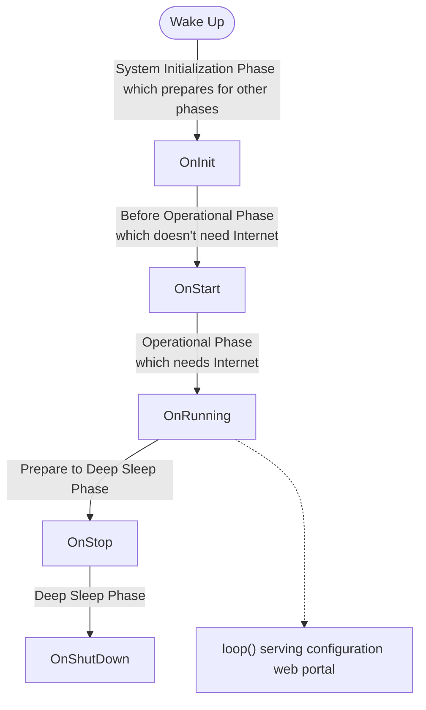

# Boot Process

MyStation uses a sophisticated multi-phase boot process that adapts based on the device's configuration state. This
ensures a smooth user experience from first boot through normal operation.

## Boot Life Cycle



## Detailed Boot Life Cycle

There are five main Life Cycle phases during the boot process.
It usually goes through all phases in order.
But, it can be skipped or getting into looped, based on the next lifecycle state.
_loop_ indicates the ESP32 Arduiono loop() function, which is implement this project for serving the configuration
http web portal.

**Key Actions**:

1. OnInit: System Initialization Phase which initializes global instances
    - Initialize Serial Communication if needed
    - Print Wake-up Diagnostics
    - Check If factory Reset is desired
    - Initialize Display
    - Initialize Font
    - Initialize Battery Monitoring
    - Check Battery Level, if it is too low, show Battery Low Screen, jump to OnShutDown
    - Load configuration from NVS
1. OnStart: Before Operational Phase which doesn't have Internet access
    - Start configuration Phase 1 if needed : Wifi Manager Configuration
    - Start Wifi connection. If it gets failed, show Wifi Error Screen, jump to OnStop
    - Set up Time if it needed
    - Setup by pressing buttons changes display mode while running - To make
    - Set temporary display mode if needed - To Move
1. OnRunning: Operational Phase which has Internet access
    - Start configuration Phase 2 if needed : Application Configuration, jump to loop
    - OTA Update Check by checking scheduled time with RTC clock time
    - Fetch Data from APIs and Update Display
1. OnStop: Prepare to Deep Sleep Phase
    - Calculate next wake-up time
    - clean up temporary states if needed - To make
    - Setup by pressing buttons can be woken up
1. OnShutDown: Deep Sleep Phase
    - Turn off peripherals
    - Enter deep sleep mode

## Operation Modes

### Display Mode Selection

In Operation Mode, it determines which Display Mode must be applied now.
If a Button is pushed by user to choose display mode, it precedence over Configuration State.
If the Button is not pushed by user, it follows Configuration State.
The Half-and-Half Display Mode is only applied when it is in active transport time range.

### Data fetching and Display Update

Weather Data is not actively changed very often. So it is cached in RTC Memory. if the cached data is expired,
it will be fetched again from the API server. Cache Expire time is 60 minutes default.
However, Transport Data is actively changed. So it is always fetched from the API server on each update cycle.

## Configuration State

**Configuration Phase 1 → Phase 2**:

- WiFi credentials saved
- Save to NVS, set phase, restart

**Configuration Phase 2 → Phase 3**:

- Station and preferences configured
- Save to NVS, set phase, restart

**Phase 3 → Phase 3**:

- Fetch data, update display, sleep

## Deep Sleep and Wake-up

### Entering Deep Sleep

```cpp
void enterDeepSleepWithButtonWakeup(uint32_t seconds) {
    // 1. Enable timer wake-up
    esp_sleep_enable_timer_wakeup(seconds * 1000000ULL);

    #ifdef BOARD_ESP32_S3
    // 2. Enable button wake-up
    esp_sleep_enable_ext0_wakeup(GPIO_BUTTON_1, 0);  // LOW
    esp_sleep_enable_ext0_wakeup(GPIO_BUTTON_2, 0);
    esp_sleep_enable_ext0_wakeup(GPIO_BUTTON_3, 0);
    #endif

    // 3. Enter deep sleep
    ESP_LOGI(TAG, "Entering deep sleep");
    esp_deep_sleep_start();

    // Never reaches here (device resets on wake)
}
```

### Wake-up Sources

1. **Timer**: Scheduled update interval
2. **Button**: User pressed button (ESP32-S3)
3. **Reset**: Manual reset button pressed

### After Wake-up

```cpp
void checkWakeupReason() {
    esp_sleep_wakeup_cause_t cause = esp_sleep_get_wakeup_cause();

    switch (cause) {
        case ESP_SLEEP_WAKEUP_TIMER:
            ESP_LOGI(TAG, "Woken by timer");
            break;

        case ESP_SLEEP_WAKEUP_EXT0:
        case ESP_SLEEP_WAKEUP_EXT1:
            ESP_LOGI(TAG, "Woken by button");
            break;

        default:
            ESP_LOGI(TAG, "Not a deep sleep wake");
            break;
    }
}
```

## RTC Memory

Data that persists across deep sleep (in RTC RAM):

```cpp
// src/main.cpp
RTC_DATA_ATTR unsigned long wakeupCount = 0;
RTC_DATA_ATTR DisplayMode temporaryMode = DISPLAY_MODE_NONE;
RTC_DATA_ATTR unsigned long temporaryModeStart = 0;
```

**Usage**:

- Loop counter (debugging)
- Temporary display mode (button press)
- Mode start time (timeout tracking)

## Debugging Boot Process

### Enable Verbose Logging

```cpp
// In setup()
esp_log_level_set("*", ESP_LOG_VERBOSE);
esp_log_level_set("WIFI", ESP_LOG_DEBUG);
esp_log_level_set("BOOT", ESP_LOG_DEBUG);
```

### Serial Monitor Output

```bash
pio device monitor --filter log2line
```

Note: in platformio.ini use buildflat `DPRODUCTION=0`, which will make a start delay for serial monitor connection.

## Related Documentation

- [Architecture](architecture.md) - System overview
- [Configuration System](configuration-system.md) - NVS and config details
- [Power Management](power-management.md) - Deep sleep implementation
- [WiFi Management](wifi-management.md) - WiFi connection handling

---

