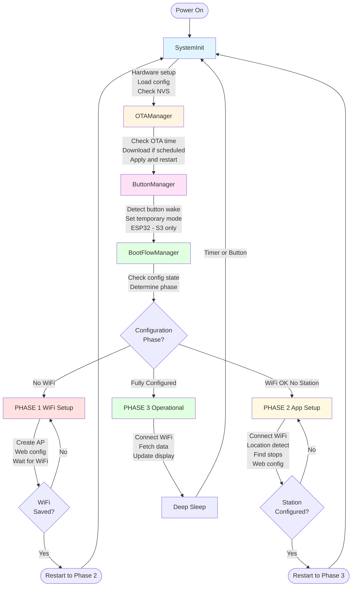
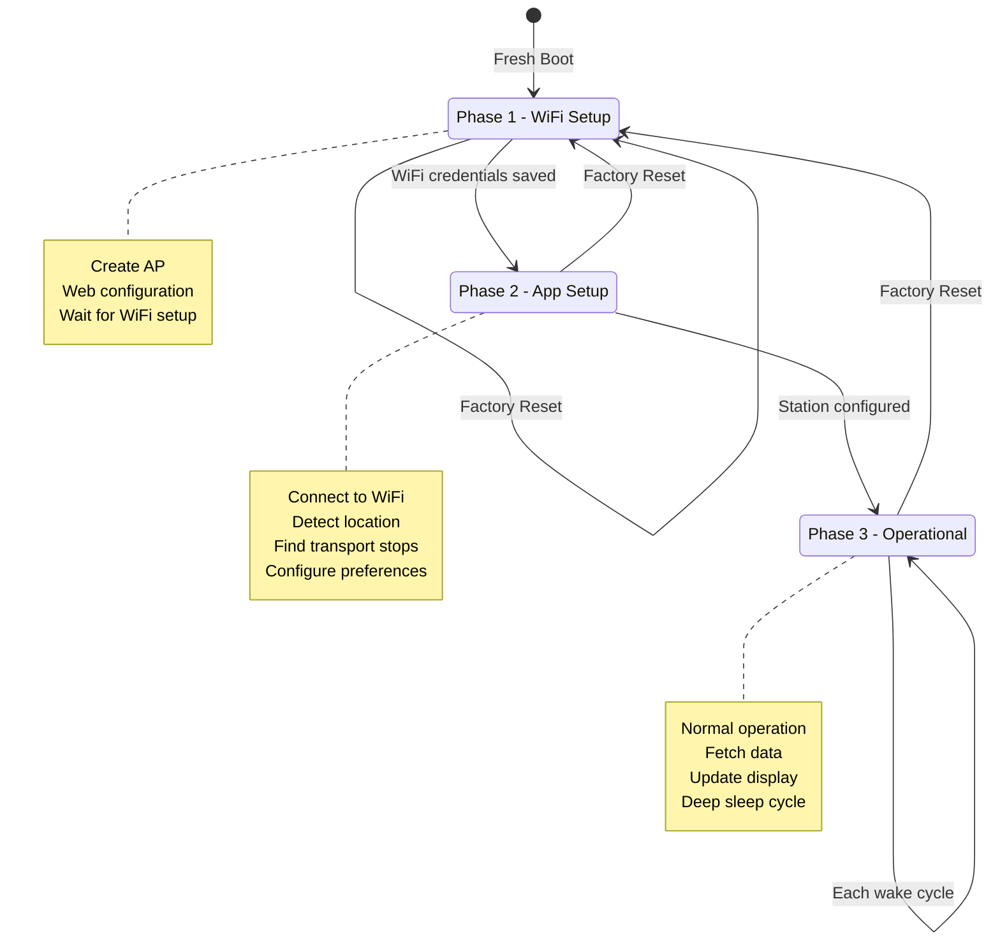

# Boot Process

This document describes the detailed boot process and flow of MyStation, including the three-phase configuration system.

## Overview

MyStation uses a sophisticated multi-phase boot process that adapts based on the device's configuration state. This
ensures a smooth user experience from first boot through normal operation.

## Boot Sequence



## Detailed Boot Steps

### Step 1: System Initialization

**File**: `src/util/system_init.cpp`

```cpp
void SystemInit::initialize() {
    // 1. Serial communication
    Serial.begin(115200);

    // 2. Logging setup
    esp_log_level_set("*", ESP_LOG_INFO);

    // 3. Print diagnostics
    printBootInfo();        // Reset reason, chip info
    printMemoryInfo();      // Heap, PSRAM

    // 4. NVS initialization
    initializeNVS();

    // 5. Load configuration from NVS
    ConfigManager::loadFromNVS();

    // 6. Factory reset check (ESP32-S3)
    checkFactoryReset();

    // 7. Battery initialization (ESP32-S3)
    BatteryManager::init();

    // 8. Button initialization (ESP32-S3)
    ButtonManager::init();
}
```

**Key Actions**:

- ✅ Initialize serial at 115200 baud
- ✅ Set up logging subsystem
- ✅ Print boot diagnostics (reset reason, memory)
- ✅ Initialize NVS (create if doesn't exist)
- ✅ Load configuration from NVS
- ✅ Check for factory reset button (ESP32-S3)
- ✅ Initialize battery monitoring (ESP32-S3)
- ✅ Initialize buttons (ESP32-S3)

**Serial Output**:

```
[MAIN] System starting...
[MAIN] Reset reason: Power-on reset
[MAIN] Free heap: 312564 bytes
[MAIN] NVS initialized
[MAIN] Configuration loaded
```

### Step 2: OTA Update Check

**File**: `src/util/ota_manager.cpp`

```cpp
void OTAManager::checkAndApplyUpdate() {
    // 1. Check if it's OTA time
    if (!isOTATime()) {
        return;  // Not scheduled, skip
    }

    // 2. Connect to WiFi
    if (!connectWiFi()) {
        return;  // Can't check without WiFi
    }

    // 3. Check for update
    if (checkForUpdate()) {
        // 4. Download and apply
        downloadAndApply();
        // 5. Restart
        ESP.restart();
    }
}
```

**When Updates Happen**:

- Default: 3:00 AM (configurable)
- Only if WiFi configured
- Only on scheduled day (e.g., weekly)
- Can be disabled

**Serial Output**:

```
[OTA] Checking for updates...
[OTA] Current version: 1.2.3
[OTA] Latest version: 1.2.4
[OTA] Downloading update...
[OTA] Update successful, restarting...
```

### Step 3: Button Wake Detection

**File**: `src/util/button_manager.cpp`

```cpp
void ButtonManager::handleWakeupMode() {
    #ifdef BOARD_ESP32_S3
    // 1. Check if woken by button
    if (wasWokenByButton()) {
        // 2. Determine which button
        int8_t mode = getWakeupButtonMode();

        // 3. Set temporary display mode
        setTemporaryMode(mode);

        ESP_LOGI(TAG, "Button wake: mode %d", mode);
    }
    #endif
}
```

**Button Modes**:

- GPIO 2: DISPLAY_MODE_HALF_AND_HALF (0)
- GPIO 3: DISPLAY_MODE_WEATHER_ONLY (1)
- GPIO 5: DISPLAY_MODE_DEPARTURE_ONLY (2)

**Serial Output**:

```
[BUTTON] Woken by button press
[BUTTON] GPIO 3 detected
[BUTTON] Temporary mode: 1 (Weather Only)
```

### Step 4: Boot Flow Determination

**File**: `src/util/boot_flow_manager.cpp`

```cpp
void BootFlowManager::handleBootFlow() {
    // 1. Determine current phase
    ConfigPhase phase = ConfigManager::getPhase();

    // 2. Execute appropriate flow
    switch (phase) {
        case PHASE_WIFI_SETUP:
            handlePhase1_WiFiSetup();
            break;

        case PHASE_APP_SETUP:
            handlePhase2_AppSetup();
            break;

        case PHASE_OPERATIONAL:
            handlePhase3_Operational();
            break;
    }
}
```

**Phase Determination Logic**:

```cpp
ConfigPhase ConfigManager::getPhase() {
    // Check WiFi configured
    if (!isWiFiConfigured()) {
        return PHASE_WIFI_SETUP;  // Phase 1
    }

    // Check app configured (station, API keys)
    if (!isAppConfigured()) {
        return PHASE_APP_SETUP;   // Phase 2
    }

    // Fully configured
    return PHASE_OPERATIONAL;     // Phase 3
}
```

## Phase 1: WiFi Setup

**Trigger**: No WiFi credentials in NVS

**File**: `src/util/boot_flow_manager.cpp`

```cpp
void BootFlowManager::handlePhase1_WiFiSetup() {
    ESP_LOGI(TAG, "Phase 1: WiFi Setup");

    // 1. Start WiFiManager in AP mode
    WiFiManager wm;
    wm.setConfigPortalBlocking(false);
    wm.startConfigPortal("MyStation");

    // 2. Start web server
    setupWebServer();
    server.begin();

    // 3. Show QR code on display (optional)
    showConfigQRCode();

    // 4. Enter event loop
    while (true) {
        wm.process();           // Handle WiFi config
        server.handleClient();  // Handle web requests

        // Check if WiFi configured
        if (ConfigManager::isWiFiConfigured()) {
            // Transition to Phase 2
            ConfigManager::setPhase(PHASE_APP_SETUP);
            ESP.restart();
        }

        delay(10);
    }
}
```

**User Experience**:

1. Device creates WiFi access point: `MyStation-XXXXXXXX`
2. User connects to AP
3. Captive portal appears (or manual navigation to 10.0.1.1)
4. User selects home WiFi and enters password
5. Device saves credentials and restarts

**Serial Output**:

```
[BOOT] Phase 1: WiFi Setup
[WIFI] Starting AP mode
[WIFI] AP SSID: MyStation-A1B2C3D4
[WIFI] AP IP: 10.0.1.1
[WEB] Server started on port 80
[WIFI] Client connected
[WIFI] WiFi credentials received
[CONFIG] Saving WiFi configuration
[CONFIG] Transitioning to Phase 2
[MAIN] Restarting...
```

## Phase 2: App Setup

**Trigger**: WiFi configured, but no station/app settings

**File**: `src/util/boot_flow_manager.cpp`

```cpp
void BootFlowManager::handlePhase2_AppSetup() {
    ESP_LOGI(TAG, "Phase 2: App Setup");

    // 1. Connect to WiFi
    if (!connectWiFi()) {
        // Fall back to Phase 1
        ConfigManager::setPhase(PHASE_WIFI_SETUP);
        ESP.restart();
        return;
    }

    // 2. Get location (Google Geolocation API)
    Location loc = getLocation();
    ConfigManager::setLocation(loc);

    // 3. Find nearby stops (RMV API)
    auto stops = findNearbyStops(loc);

    // 4. Start web server for configuration
    setupWebServer();
    server.begin();

    // 5. Show configuration prompt on display
    showConfigPrompt();

    // 6. Enter event loop
    while (true) {
        server.handleClient();

        // Check if app configured
        if (ConfigManager::isAppConfigured()) {
            // Transition to Phase 3
            ConfigManager::setPhase(PHASE_OPERATIONAL);
            ESP.restart();
        }

        delay(10);
    }
}
```

**User Experience**:

1. Device connects to home WiFi
2. Automatically detects location
3. Finds nearby transport stops
4. User navigates to `http://mystation.local` or IP address
5. User selects station and preferences
6. Device saves configuration and restarts

**Serial Output**:

```
[BOOT] Phase 2: App Setup
[WIFI] Connecting to: MyHomeWiFi
[WIFI] Connected, IP: 192.168.1.42
[LOC] Detecting location...
[LOC] Location: 50.1109°N, 8.6821°E (Frankfurt)
[RMV] Finding nearby stops...
[RMV] Found 12 stops
[WEB] Server started
[CONFIG] Station selected: Frankfurt Hauptbahnhof
[CONFIG] Display mode: Half & Half
[CONFIG] Update interval: 5 minutes
[CONFIG] Transitioning to Phase 3
[MAIN] Restarting...
```

## Phase 3: Operational Mode

**Trigger**: Fully configured (WiFi + App settings)

**File**: `src/util/boot_flow_manager.cpp`

```cpp
void BootFlowManager::handlePhase3_Operational() {
    ESP_LOGI(TAG, "Phase 3: Operational");

    // 1. Check temporary mode (button wake)
    int8_t displayMode = ConfigManager::getDisplayMode();
    if (ButtonManager::isTemporaryMode()) {
        displayMode = ButtonManager::getTemporaryMode();
    }

    // 2. Connect to WiFi
    if (!connectWiFi()) {
        ESP_LOGE(TAG, "WiFi connection failed");
        enterDeepSleep(300);  // Retry in 5 minutes
        return;
    }

    // 3. Fetch data based on display mode
    WeatherData weather;
    DepartureData departures;

    if (displayMode != DISPLAY_MODE_DEPARTURE_ONLY) {
        weather = fetchWeatherData();
    }

    if (displayMode != DISPLAY_MODE_WEATHER_ONLY) {
        departures = fetchDepartureData();
    }

    // 4. Update display
    DisplayManager::update(displayMode, weather, departures);

    // 5. Calculate next wake time
    uint32_t sleepSeconds = calculateSleepDuration();

    // 6. Enter deep sleep
    ESP_LOGI(TAG, "Sleeping for %d seconds", sleepSeconds);
    enterDeepSleepWithButtonWakeup(sleepSeconds);
}
```

**Normal Operation Cycle**:

```
Wake → Connect → Fetch → Display → Sleep
 ↑                                    │
 └────────────────────────────────────┘
        (Update interval, e.g., 5 min)
```

**Serial Output**:

```
[BOOT] Phase 3: Operational
[WIFI] Connecting to: MyHomeWiFi
[WIFI] Connected in 2.3s
[WEATHER] Fetching data for Frankfurt
[WEATHER] Temperature: 22°C, Sunny
[RMV] Fetching departures for Frankfurt Hbf
[RMV] Got 15 departures
[DISPLAY] Rendering Half & Half mode
[DISPLAY] Update complete in 34.2s
[SLEEP] Next wake in 300 seconds (5 min)
[SLEEP] Entering deep sleep...
```

## Configuration State Machine



### Phase Transitions

**Phase 1 → Phase 2**:

- Trigger: WiFi credentials saved
- Action: Save to NVS, set phase, restart

**Phase 2 → Phase 3**:

- Trigger: Station and preferences configured
- Action: Save to NVS, set phase, restart

**Phase 3 → Phase 3**:

- Trigger: Wake from deep sleep
- Action: Fetch data, update display, sleep

**Any Phase → Phase 1** (Factory Reset):

- Trigger: Factory reset button (5s hold during boot)
- Action: Erase NVS, restart

## Deep Sleep and Wake-up

### Entering Deep Sleep

```cpp
void enterDeepSleepWithButtonWakeup(uint32_t seconds) {
    // 1. Enable timer wake-up
    esp_sleep_enable_timer_wakeup(seconds * 1000000ULL);

    #ifdef BOARD_ESP32_S3
    // 2. Enable button wake-up
    esp_sleep_enable_ext0_wakeup(GPIO_BUTTON_1, 0);  // LOW
    esp_sleep_enable_ext0_wakeup(GPIO_BUTTON_2, 0);
    esp_sleep_enable_ext0_wakeup(GPIO_BUTTON_3, 0);
    #endif

    // 3. Enter deep sleep
    ESP_LOGI(TAG, "Entering deep sleep");
    esp_deep_sleep_start();

    // Never reaches here (device resets on wake)
}
```

### Wake-up Sources

1. **Timer**: Scheduled update interval
2. **Button**: User pressed button (ESP32-S3)
3. **Reset**: Manual reset button pressed

### After Wake-up

```cpp
void checkWakeupReason() {
    esp_sleep_wakeup_cause_t cause = esp_sleep_get_wakeup_cause();

    switch (cause) {
        case ESP_SLEEP_WAKEUP_TIMER:
            ESP_LOGI(TAG, "Woken by timer");
            break;

        case ESP_SLEEP_WAKEUP_EXT0:
        case ESP_SLEEP_WAKEUP_EXT1:
            ESP_LOGI(TAG, "Woken by button");
            break;

        default:
            ESP_LOGI(TAG, "Not a deep sleep wake");
            break;
    }
}
```

## RTC Memory

Data that persists across deep sleep (in RTC RAM):

```cpp
// src/main.cpp
RTC_DATA_ATTR unsigned long loopCount = 0;
RTC_DATA_ATTR DisplayMode temporaryMode = DISPLAY_MODE_NONE;
RTC_DATA_ATTR unsigned long temporaryModeStart = 0;
```

**Usage**:

- Loop counter (debugging)
- Temporary display mode (button press)
- Mode start time (timeout tracking)

## Boot Time Optimization

### Typical Boot Times

| Phase          | Activity             | Time        |
|----------------|----------------------|-------------|
| Hardware Init  | CPU, peripherals     | ~1s         |
| NVS Load       | Read configuration   | &lt;0.1s    |
| WiFi Connect   | Join network         | 2-5s        |
| API Calls      | Weather + Departures | 5-10s       |
| Display Update | E-paper refresh      | 30-45s      |
| **Total**      |                      | **~40-60s** |

### Optimization Strategies

1. **Parallel API calls** - Fetch weather and departures simultaneously
2. **WiFi connection caching** - Store credentials in RTC memory
3. **Aggressive timeouts** - Don't wait too long for failed connections
4. **Conditional data fetch** - Only fetch what's needed for display mode
5. **Fast boot path** - Skip initialization in deep sleep wake

## Error Handling

### WiFi Connection Failure

```cpp
if (!connectWiFi()) {
    ESP_LOGE(TAG, "WiFi failed");

    if (retryCount < MAX_RETRIES) {
        // Retry in 1 minute
        enterDeepSleep(60);
    } else {
        // Fall back to config mode
        ConfigManager::setPhase(PHASE_WIFI_SETUP);
        ESP.restart();
    }
}
```

### API Failure

```cpp
if (!fetchWeatherData(&weather)) {
    ESP_LOGW(TAG, "Weather fetch failed, using cached data");
    weather = loadCachedWeather();
}
```

### Display Failure

```cpp
if (!DisplayManager::update(...)) {
    ESP_LOGE(TAG, "Display update failed");
    // Continue anyway, will retry on next wake
}
```

## Debugging Boot Process

### Enable Verbose Logging

```cpp
// In setup()
esp_log_level_set("*", ESP_LOG_VERBOSE);
esp_log_level_set("WIFI", ESP_LOG_DEBUG);
esp_log_level_set("BOOT", ESP_LOG_DEBUG);
```

### Serial Monitor Output

```bash
pio device monitor --filter log2line
```

### Boot Diagnostics

```cpp
void printBootInfo() {
    Serial.printf("Reset reason: %s\n", getResetReason());
    Serial.printf("Boot count: %lu\n", bootCount);
    Serial.printf("Free heap: %d bytes\n", ESP.getFreeHeap());
    Serial.printf("Phase: %d\n", ConfigManager::getPhase());
}
```

## Related Documentation

- [Architecture](architecture.md) - System overview
- [Configuration System](configuration-system.md) - NVS and config details
- [Power Management](power-management.md) - Deep sleep implementation
- [WiFi Management](wifi-management.md) - WiFi connection handling

---

**Key Takeaway**: The three-phase boot process ensures a seamless experience from first boot to normal operation, with
automatic recovery from errors and graceful degradation when services are unavailable.

