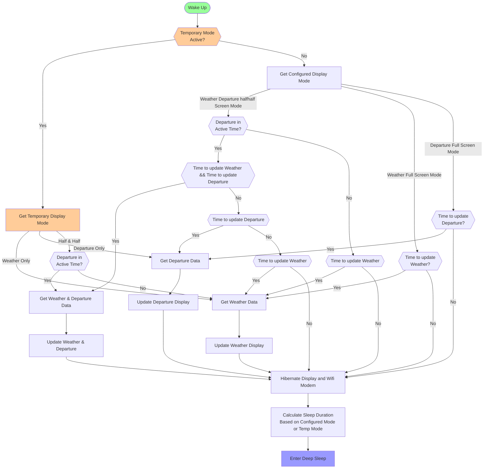

### Boot Process Flow



Pseudo Code for Sleep Preparation

```c++
function cacluateSleepDuration() {
    time currentTime = time.Now();
    time nextDepartureUpdate = 0;
    time nextWeatherUpdate = 0;
    time nextWakeupTime = 0;

    // Calculate next departure update time
    if (config.displayMode == 0 || config.displayMode == 2) { // half-and-half or departure-only
        time lastDepartureUpdate = getLastTransportUpdate();
        nextDepartureUpdate = lastDepartureUpdate + (config.transportInterval * 60); // minutes to seconds
    }

    // Calculate next weather update time
    if (config.displayMode == 0 || config.displayMode == 1) { // half-and-half or weather-only
        time lastWeatherUpdate = getLastWeatherUpdate();
        nextWeatherUpdate = lastWeatherUpdate + (config.weatherInterval * 3600); // hours to seconds
    }

    // Determine earliest required update
    if (nextDepartureUpdate > 0 && nextWeatherUpdate > 0) {
        // Both updates needed - wake up for the earliest one
        nextWakeupTime = min(nextDepartureUpdate, nextWeatherUpdate);
    } else if (nextDepartureUpdate > 0) {
        // Only departure update needed
        nextWakeupTime = nextDepartureUpdate;
    } else if (nextWeatherUpdate > 0) {
        // Only weather update needed
        nextWakeupTime = nextWeatherUpdate;
    } else {
        // Default fallback - wake up in 1 minute
        nextWakeupTime = currentTime + 60;
    }

    // Calculate sleep duration in seconds
    int sleepDurationSeconds = nextWakeupTime - currentTime;

    // Ensure minimum sleep time and maximum reasonable sleep time
    if (sleepDurationSeconds < 30) {
        sleepDurationSeconds = 30; // Minimum 30 seconds
    }

    if (isInConfiguredDeepSleepTime(sleepDurationSeconds)){
        sleepDurationSeconds = getConfiguredDeepSleepEndDurationSecond();
    }

    // Convert to microseconds for ESP32 deep sleep
    esp_deep_sleep(sleepDurationSeconds * 1000000ULL);
}
```
