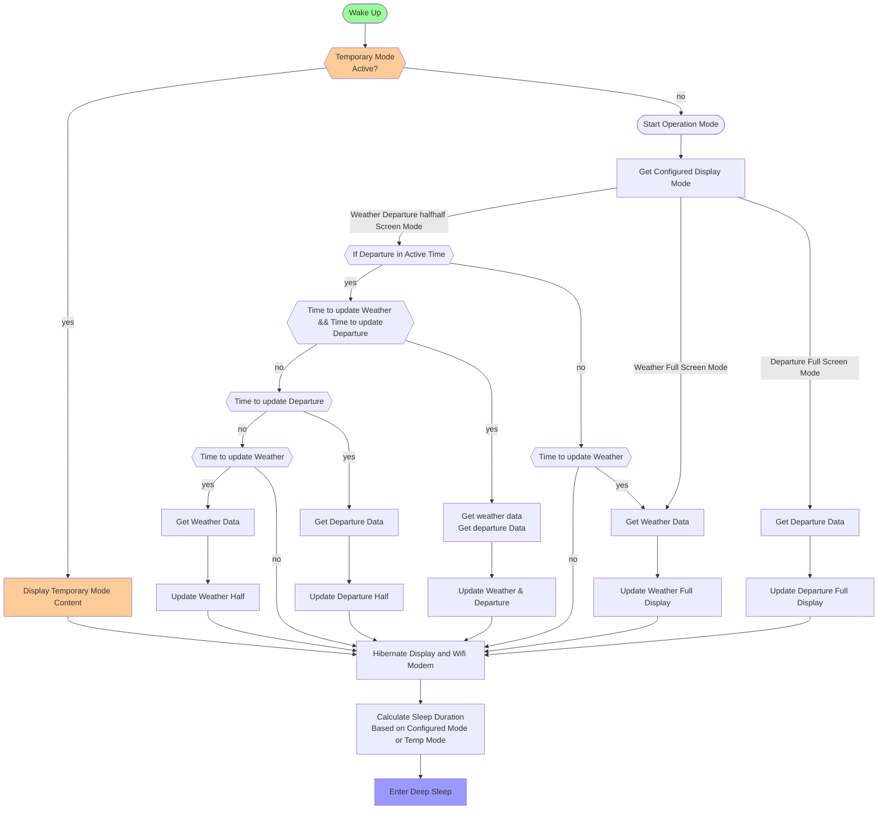

### Boot Process Flow



## Temporary Mode Behavior

### Overview

Users can press one of three buttons to activate temporary mode and display specific information (weather-only,
departure-only, or half-and-half), overriding the configured display mode temporarily.

### Key Behaviors

✅ **Always responds to button** - Works 24/7, even during deep sleep period
✅ **2-minute display in active hours** - Full viewing time outside deep sleep period
✅ **During sleep phase** - Display temp mode when user pressed and stay until next scheduled wake
✅ **Stays in temp mode through deep sleep start** - Doesn't prematurely switch to configured mode
✅ **Exits on natural wake cycle** - Returns to configured mode at next scheduled wake

### Temporary Mode State Structure

```c++
// RTC memory (survives deep sleep)
RTC_DATA_ATTR struct {
    time_t activationTime;      // When temp mode was activated
    uint8_t tempDisplayMode;    // 0=half, 1=weather, 2=departure
    bool isActive;              // Is temp mode currently active
} tempMode = {0, 0, false};

const int TEMP_MODE_ACTIVE_DURATION = 120;  // 2 minutes during active hours
```

### Button Press Handler

```c++
void handleButtonPress(uint8_t buttonMode) {
    time_t currentTime = time(nullptr);
    bool inDeepSleepPeriod = isInConfiguredDeepSleepTime(currentTime, 0);

    // Activate temp mode
    if (tempMode.isActive && tempMode.tempDisplayMode == buttonMode) {
        // Same button - reset timer
        tempMode.activationTime = currentTime;
        Serial.println("Temp mode: timer reset");
    } else if (tempMode.isActive) {
        // Different button - switch mode and reset timer
        tempMode.activationTime = currentTime;
        tempMode.tempDisplayMode = buttonMode;
        Serial.println("Temp mode: switched mode");
    } else {
        // First activation
        tempMode.isActive = true;
        tempMode.activationTime = currentTime;
        tempMode.tempDisplayMode = buttonMode;
        Serial.printf("Temp mode: activated\n");
    }

    // Immediately display requested mode
    displayModeContent(buttonMode);
}
```

### Timing Examples

#### Example 1: Button during active hours (10:00)

```
10:00:00 - Button pressed → Temp mode activated
10:00:05 - Sleep for 115 seconds
10:02:00 - Wake → Temp mode 2 minutes complete, exit temp mode
10:02:00 - Display configured mode → Calculate next refresh (e.g., 10:15)
10:02:05 - Sleep until 10:15
```

#### Example 2: Button before deep sleep (22:58)

```
22:58:00 - Button pressed → Temp mode activated
22:58:05 - Sleep for 115 seconds
23:00:00 - Wake → Deep sleep period started, temp mode still active
23:00:00 - STAY in temp mode (don't switch to configured mode)
23:00:05 - Sleep until next scheduled wake (06:00)
06:00:00 - Wake from deep sleep → Exit temp mode, show configured mode
```

#### Example 3: Button during deep sleep (01:00)

```
01:00:00 - Button pressed → Wake up, temp mode activated
01:00:00 - Display temp mode immediately
01:00:05 - STAY in temp mode, sleep until next scheduled wake (06:00)
06:00:00 - Wake from deep sleep → Exit temp mode, show configured mode
```

#### Example 4: Deep sleep ends during temp mode

```
05:59:30 - Button pressed during deep sleep → Temp mode activated
05:59:35 - Display temp mode, stay until next wake
06:00:00 - Wake from deep sleep → Exit temp mode, show configured mode
```

## Pseudo Code for Sleep Preparation

```c++
function calculateSleepDuration() {
    time currentTime = time.Now();
    time nextDepartureUpdate = 0;
    time nextWeatherUpdate = 0;
    time nextWakeupTime = 0;
    int sleepDurationSeconds;
    bool inDeepSleepPeriod = isInConfiguredDeepSleepTime(currentTime, 0);

    // Handle temporary mode
    if (tempMode.isActive) {
        int elapsed = currentTime - tempMode.activationTime;
        int requiredDuration = TEMP_MODE_ACTIVE_DURATION;  // 2 minutes
        int remaining = requiredDuration - elapsed;

        if (remaining > 0 && !inDeepSleepPeriod) {
            // Still showing temp mode during active hours
            sleepDurationSeconds = remaining;
            Serial.printf("Temp mode: %d seconds remaining\n", remaining);
        } else if (remaining > 0 && inDeepSleepPeriod) {
            // Temp mode active but in deep sleep period - stay until next wake
            sleepDurationSeconds = getConfiguredDeepSleepEndDurationSecond(currentTime);
            Serial.println("Temp mode: staying active until next scheduled wake");
        } else if (inDeepSleepPeriod) {
            // 2 minutes complete but still in deep sleep - stay in temp mode
            sleepDurationSeconds = getConfiguredDeepSleepEndDurationSecond(currentTime);
            Serial.println("Temp mode: staying until deep sleep end");
        } else {
            // 2 minutes complete and in active hours - exit temp mode
            Serial.println("Temp mode: exiting on next wake");
            tempMode.isActive = false;
            nextWakeupTime = calculateNextConfiguredRefresh(currentTime);
            sleepDurationSeconds = max(30, (int)(nextWakeupTime - currentTime));
        }
    } else {
        // Normal configured mode operation
        if (inDeepSleepPeriod) {
            sleepDurationSeconds = getConfiguredDeepSleepEndDurationSecond(currentTime);
        } else {
            // Calculate next departure update time
            if (config.displayMode == 0 || config.displayMode == 2) {
                time lastDepartureUpdate = getLastTransportUpdate();
                nextDepartureUpdate = lastDepartureUpdate + (config.transportInterval * 60);
            }

            // Calculate next weather update time
            if (config.displayMode == 0 || config.displayMode == 1) {
                time lastWeatherUpdate = getLastWeatherUpdate();
                nextWeatherUpdate = lastWeatherUpdate + (config.weatherInterval * 3600);
            }

            // Determine earliest required update
            if (nextDepartureUpdate > 0 && nextWeatherUpdate > 0) {
                nextWakeupTime = min(nextDepartureUpdate, nextWeatherUpdate);
            } else if (nextDepartureUpdate > 0) {
                nextWakeupTime = nextDepartureUpdate;
            } else if (nextWeatherUpdate > 0) {
                nextWakeupTime = nextWeatherUpdate;
            } else {
                nextWakeupTime = currentTime + 60;
            }

            sleepDurationSeconds = max(30, (int)(nextWakeupTime - currentTime));

            // Check if deep sleep starts before next refresh
            time deepSleepStartTime = getNextDeepSleepStartTime(currentTime);
            if (deepSleepStartTime > 0 && deepSleepStartTime < (currentTime + sleepDurationSeconds)) {
                sleepDurationSeconds = deepSleepStartTime - currentTime;
            }
        }
    }

    // Ensure minimum sleep time
    sleepDurationSeconds = max(30, sleepDurationSeconds);

    // Convert to microseconds for ESP32 deep sleep
    esp_deep_sleep(sleepDurationSeconds * 1000000ULL);
}

function calculateNextConfiguredRefresh(time currentTime) {
    time nextDeparture = 0;
    time nextWeather = 0;

    if (config.displayMode == 0 || config.displayMode == 2) {
        time lastDeparture = getLastTransportUpdate();
        nextDeparture = lastDeparture + (config.transportInterval * 60);
    }

    if (config.displayMode == 0 || config.displayMode == 1) {
        time lastWeather = getLastWeatherUpdate();
        nextWeather = lastWeather + (config.weatherInterval * 3600);
    }

    if (nextDeparture > 0 && nextWeather > 0) {
        return min(nextDeparture, nextWeather);
    } else if (nextDeparture > 0) {
        return nextDeparture;
    } else if (nextWeather > 0) {
        return nextWeather;
    }

    return currentTime + 60;
}

function getNextDeepSleepStartTime(time currentTime) {
    struct tm* timeinfo = localtime(&currentTime);
    int currentHour = timeinfo->tm_hour;

    if (currentHour < 23) {
        timeinfo->tm_hour = 23;
        timeinfo->tm_min = 0;
        timeinfo->tm_sec = 0;
        return mktime(timeinfo);
    }

    return 0;
}
```
