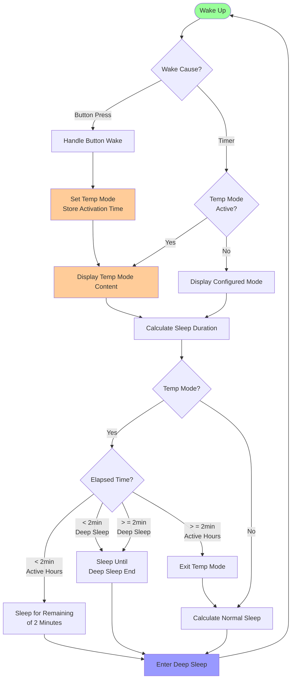

# Temporary Mode Implementation

## Overview

The temporary mode feature allows users to press physical buttons to temporarily override the configured display mode.
This provides immediate access to specific information (weather-only, departure-only, or half-and-half) without changing
the permanent configuration.

## Key Features

✅ **Always responds to button** - Works 24/7, even during deep sleep period

✅ **2-minute display in active hours** - Full viewing time outside deep sleep period

✅ **During sleep phase** - Display temp mode when user pressed and stay until next scheduled wake

✅ **Stays in temp mode through deep sleep start** - Doesn't prematurely switch to configured mode

✅ **Exits on natural wake cycle** - Returns to configured mode at next scheduled wake

## Implementation Components

### 1. RTC Memory Structure

**File:** `include/config/config_manager.h`

```cpp
struct RTCConfigData {
    // ... other fields ...

    // Temporary button mode (ESP32-S3 only)
    bool inTemporaryMode;                   // Flag if we're in temporary mode
    uint8_t temporaryDisplayMode;            // Temporary override mode (0xFF = none)
    uint32_t temporaryModeActivationTime;    // When temporary mode was activated (epoch)
};
```

### 2. Button Manager

**File:** `src/util/button_manager.cpp`

The button manager detects button wake-up from deep sleep and activates temporary mode:

```cpp
void ButtonManager::handleWakeupMode() {
    int8_t buttonMode = getWakeupButtonMode();
    if (buttonMode >= 0) {
        RTCConfigData& config = ConfigManager::getConfig();
        time_t currentTime;
        time(&currentTime);

        if (config.inTemporaryMode && config.temporaryDisplayMode == buttonMode) {
            // Same button - reset timer
            config.temporaryModeActivationTime = (uint32_t)currentTime;
        } else if (config.inTemporaryMode) {
            // Different button - switch mode and reset timer
            config.temporaryDisplayMode = buttonMode;
            config.temporaryModeActivationTime = (uint32_t)currentTime;
        } else {
            // First activation
            config.inTemporaryMode = true;
            config.temporaryDisplayMode = buttonMode;
            config.temporaryModeActivationTime = (uint32_t)currentTime;
        }
    }
}
```

### 3. Timing Manager

**File:** `src/util/timing_manager.cpp`

The timing manager handles sleep duration calculation with temporary mode logic:

```cpp
uint64_t TimingManager::getNextSleepDurationSeconds() {
    time_t now = GET_CURRENT_TIME();
    uint32_t currentTimeSeconds = (uint32_t)now;
    RTCConfigData& config = ConfigManager::getConfig();

    // Handle temporary mode first
    if (config.inTemporaryMode) {
        int elapsed = currentTimeSeconds - config.temporaryModeActivationTime;
        const int TEMP_MODE_DURATION = 120; // 2 minutes
        int remaining = TEMP_MODE_DURATION - elapsed;

        // Check if in deep sleep period
        bool inDeepSleepPeriod = isInDeepSleepPeriod(currentTimeSeconds);

        if (remaining > 0 && !inDeepSleepPeriod) {
            // Still showing temp mode during active hours
            return (uint64_t)max(30, remaining);
        }
        else if (remaining > 0 && inDeepSleepPeriod) {
            // Temp mode active but in deep sleep - stay until next wake
            return getSecondsUntilSleepEnd(currentTimeSeconds);
        }
        else if (inDeepSleepPeriod) {
            // 2 minutes complete but still in deep sleep
            return getSecondsUntilSleepEnd(currentTimeSeconds);
        }
        else {
            // 2 minutes complete and in active hours - exit temp mode
            config.inTemporaryMode = false;
            config.temporaryDisplayMode = 0xFF;
            config.temporaryModeActivationTime = 0;
            // Fall through to normal calculation
        }
    }

    // Normal configured mode calculation
    // ... (existing logic)
}
```

## User Experience Scenarios

### Scenario 1: Button during active hours (10:00)

```
10:00:00 - Button pressed → Temp mode activated
10:00:05 - Sleep for 115 seconds
10:02:00 - Wake → Temp mode 2 minutes complete, exit temp mode
10:02:00 - Display configured mode → Calculate next refresh
10:02:05 - Sleep until next configured refresh
```

### Scenario 2: Button before deep sleep (22:58)

Deep sleep configured: 23:00 - 06:00

```
22:58:00 - Button pressed → Temp mode activated
22:58:05 - Sleep for 115 seconds
23:00:00 - Wake → Deep sleep period started, temp mode still active
23:00:00 - STAY in temp mode (don't switch to configured mode)
23:00:05 - Sleep until 06:00 (end of deep sleep)
06:00:00 - Wake from deep sleep → Exit temp mode, show configured mode
```

### Scenario 3: Button during deep sleep (01:00)

```
01:00:00 - Button pressed → Wake up, temp mode activated
01:00:00 - Display temp mode immediately
01:00:05 - STAY in temp mode, sleep until 06:00
06:00:00 - Wake from deep sleep → Exit temp mode, show configured mode
```

### Scenario 4: Deep sleep ends during temp mode

```
05:59:30 - Button pressed during deep sleep → Temp mode activated
05:59:35 - Display temp mode, stay until next wake
06:00:00 - Wake from deep sleep → Exit temp mode, show configured mode
```

## Hardware Requirements

- **Board:** ESP32-S3 only (uses EXT1 wakeup feature)
- **GPIOs:** Three RTC-capable GPIOs configured as:
    - `BUTTON_HALF_AND_HALF` (GPIO 2)
    - `BUTTON_WEATHER_ONLY` (GPIO 3)
    - `BUTTON_DEPARTURE_ONLY` (GPIO 5)

## Configuration

No user configuration required. The feature is automatically enabled on ESP32-S3 boards.

Constants:

```cpp
// In button_manager.h
static constexpr uint32_t TEMP_MODE_ACTIVE_DURATION = 120; // 2 minutes
```

## Flow Diagram


