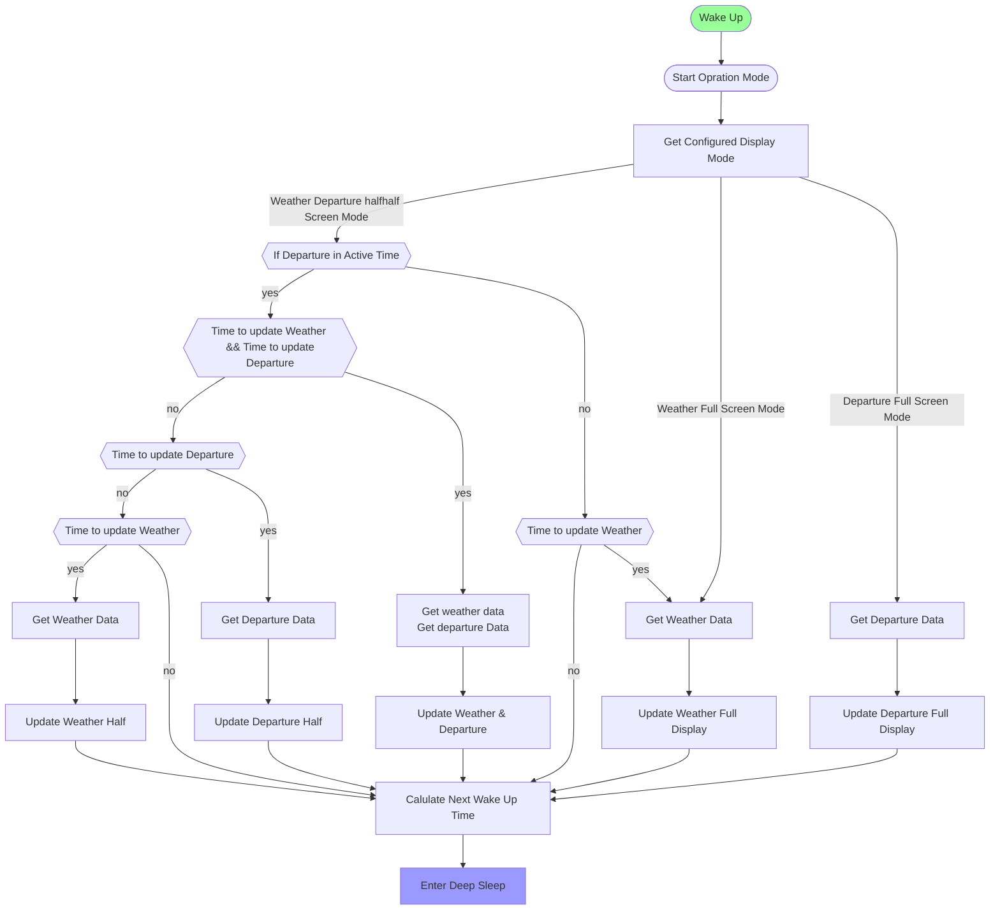

### Boot Process Flow

```mermaid
flowchart TD
    PrepareToSleep[Calulate Next Wake Up Time]
%%  Getting Configured Display Mode
    Start([Wake Up]) --> StartOperation
    StartOperation([Start Opration Mode]) --> GetDisplayMode[Get Configured Display Mode]
    GetDisplayMode -->|Weather Departure halfhalf Screen Mode| IfDepartureActive{{If Departure in Active Time}}
    GetDisplayMode -->|Weather Full Screen Mode| GetWeather[Get Weather Data] --> UpdateWeather[Update Weather Full Display] --> PrepareToSleep
    GetDisplayMode -->|Departure Full Screen Mode| GetDeparture[Get Departure Data] --> UpdateDeparture[Update Departure Full Display] --> PrepareToSleep
%%  Half Half Mode / If Departure is in Active Time
    IfDepartureActive -->|yes| IfNeedWeatherDeparture{{Time to update Weather \n && Time to update Departure}}
    IfDepartureActive -->|no| IfNeedWeatherUpdate{{Time to update Weather}}
%%  If Departure is in Active Time / If Time to update Weather & Departure
    IfNeedWeatherDeparture -->|no| IfNeedDepartureUpdate{{Time to update Departure}}
    IfNeedWeatherDeparture -->|yes| GetWeatherDepartureData[Get weather data \n Get departure Data] --> DisplayWeatherDeparture[Update Weather & Departure] --> PrepareToSleep
%%  If Time to update Weather & Departure / If Time to update Departure
    IfNeedDepartureUpdate -->|no| IfTimeToUpdateWeather{{Time to update Weather}}
    IfNeedDepartureUpdate -->|yes| GetDepartureData[Get Departure Data] --> DisplayDepartureHalf[Update Departure Half] --> PrepareToSleep
%%  If Time to update Departure / If Time to update Weather
    IfTimeToUpdateWeather -->|yes| GetWeatherData[Get Weather Data] --> DisplayWeatherHalf[Update Weather Half] --> PrepareToSleep
    IfTimeToUpdateWeather -->|no| PrepareToSleep
%%  If Departure is in Active Time / Time to update Weather
    IfNeedWeatherUpdate -->|no| PrepareToSleep
    IfNeedWeatherUpdate -->|yes| GetWeather
    PrepareToSleep --> DeepSleep[Enter Deep Sleep]
    style Start fill: #99ff99
    style DeepSleep fill: #9999ff
```
