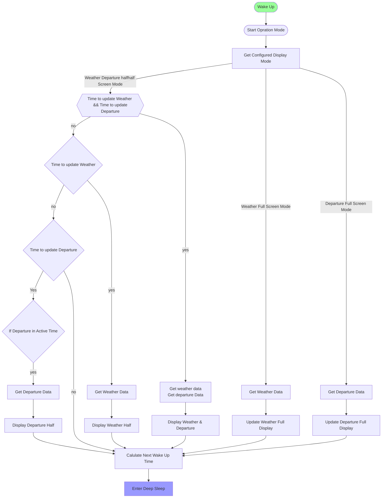

### Boot Process Flow

```mermaid
flowchart TD
    PrepareToSleep[Calulate Next Wake Up Time]
    Start([Wake Up]) --> StartOperation
    StartOperation([Start Opration Mode]) --> GetDisplayMode[Get Configured Display Mode]
    GetDisplayMode -->|Weather Departure halfhalf Screen Mode| NeedWeatherDeparture{{Time to update Weather \n && Time to update Departure}}
    GetDisplayMode -->|Weather Full Screen Mode| GetWeather[Get Weather Data]
    GetDisplayMode -->|Departure Full Screen Mode| GetDeparture[Get Departure Data]
    NeedWeatherDeparture -->|no| NeedWeatherUpdate{Time to update Weather}
    NeedWeatherDeparture -->|yes| GetWeatherDepartureData[Get weather data \n Get departure Data]
    GetWeatherDepartureData --> DisplayWeatherDeparture[Display Weather & Departure]
    DisplayWeatherDeparture --> PrepareToSleep
    NeedWeatherUpdate -->|no| NeedDepartureUpdate{Time to update Departure}
    NeedDepartureUpdate -->|Yes| CheckDepartureActive{If Departure in Active Time}
    NeedDepartureUpdate -->|no| PrepareToSleep
    NeedWeatherUpdate -->|yes| GetWeatherData[Get Weather Data]
    GetWeatherData --> DisplayWeather[Display Weather Half]
    DisplayWeather --> PrepareToSleep
    CheckDepartureActive -->|yes| GetDepartureData[Get Departure Data]
    GetDepartureData --> DisplayDeparture[Display Departure Half]
    DisplayDeparture --> PrepareToSleep
    GetWeather --> UpdateWeather[Update Weather Full Display]
    UpdateWeather --> PrepareToSleep
    GetDeparture --> UpdateDeparture[Update Departure Full Display]
    UpdateDeparture --> PrepareToSleep
    PrepareToSleep --> DeepSleep[Enter Deep Sleep]
%%    style PrepareToSleep fill: #ff9999
    style Start fill: #99ff99
    style DeepSleep fill: #9999ff
```
